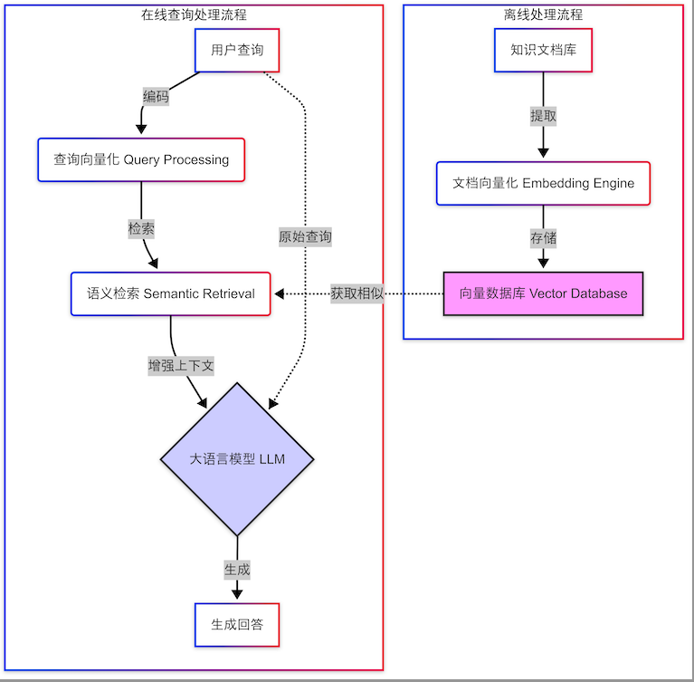

````markdown
# 解耦 RAGFlow：核心 RAG 流程的简化 Notebook 实践

## 动机 

RAGFlow 作为一个功能强大的工程项目，其代码为了确保鲁棒性而存在较高的耦合度，并包含了复杂的错误处理逻辑。这对于希望专注于理解核心 RAG 算法流程的学习者来说，无疑增加了难度和时间成本。

为了帮助对 RAGFlow 底层 RAG 算法感兴趣的朋友们更清晰、高效地掌握其核心逻辑，本项目提取并简化了 RAG 流程中的关键代码。我们将其整合到一个 Jupyter Notebook (`ragflow_simplified_walkthrough.ipynb` - *请替换为你的实际文件名*) 中，你可以通过逐个运行代码单元，直观地体验和理解从文档处理到最终生成等各个环节的操作。

## 核心目标
通过实践这份简化代码，你可以在 Jupyter Notebook 中逐一运行 RAG 的关键组件，从而深入理解其核心步骤，为将来把相关工程代码整合到自己的项目中奠定坚实基础。

## RAG核心组件

为了理解并简化 RAGFlow 的核心 RAG 流程，我们首先将其宏观上划分为**离线处理**（构建知识库）和**在线查询处理**（响应用户提问）两大阶段，并进一步细化为以下六个关键的技术步骤：

1.  **文档解析 (Document Parsing):** 从原始文件（如 PDF）中提取结构化信息。
2.  **文本分块 (Text Chunking):** 将长文本分割成大小适中的块。
3.  **嵌入生成 (Embedding Generation):** 将文本块转换为向量。
4.  **索引构建 (Indexing):** 将文本块及其向量存入检索引擎。
5.  **检索 (Retrieval):** 根据用户问题查找相关的文本块。
6.  **生成 (Generation):** 结合问题与上下文生成答案。



## 分析RAGFlow 

在梳理清楚这套标准流程之后，下一步便是深入 RAGFlow 的项目代码，定位这些步骤的具体实现。

你可以先在本地环境中将 RAGFlow 项目代码 clone 下来：
```bash
git clone [https://github.com/infiniflow/ragflow.git](https://github.com/infiniflow/ragflow.git)
````

或者，你也可以直接访问其 GitHub 仓库页面 ([https://github.com/infiniflow/ragflow](https://github.com/infiniflow/ragflow))，然后点击键盘上的 `.` 键进入 GitHub 的在线开发者模式（web editor）。

通过浏览整个项目的结构（如下图所示），你会发现与 RAG 功能最相关的主要是 `deepdoc`（负责文档解析）和 `rag`（负责 RAG 核心实现，包括文档解析、分块、嵌入、检索、生成逻辑）这两个模块。


因此，我们接下来的代码拆解和封装工作将重点围绕这两个模块进行。

例如，`rag/app/naive.py` 文件主要功能是通过对 `deepdoc` 中各个文档格式的 parser 进行继承封装（比如 `class Pdf(PdfParser)` 继承了 PDF 解析器基类），并且其中的 `chunk` 函数负责文本分块。此文件还涉及 `api`, `rag.nlp`, `rag.utils` 等依赖模块。在本项目中，我们借鉴了这种思路，通过继承和简化，并将必要的依赖模块或函数直接引入到我们的 Notebook 中，以保证代码能够顺利运行，同时避免重复造轮子。

## Getting Started

### Prerequisites

  * **Python:** \>= 3.10.16
  * **Dependencies:** You will need to install the required Python packages. It's recommended to use a virtual environment.
    ```bash
    pip install -r requirements.txt # 假设你提供了一个 requirements.txt 文件
    # 或者根据 Notebook 中的 import 语句手动安装
    ```

### How to Use

1.  **Set up environment (Recommended):**
    ```bash
    python -m venv venv
    source venv/bin/activate # Linux/macOS
    # venv\Scripts\activate # Windows
    pip install -r requirements.txt # Or install manually
    ```
2. **Open and Run:** Open the `ragflow_simplified_rag_walkthrough.ipynb` notebook.
